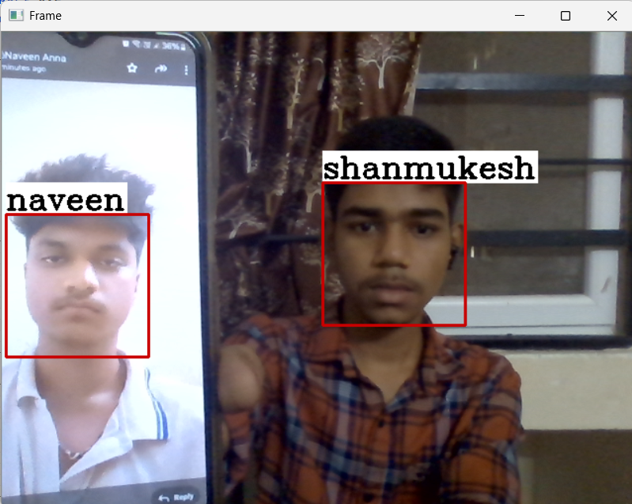

# Face Recognition and Attendance System

## Overview
This project is a **Face Recognition and Attendance System** that uses a webcam to detect faces in real-time and mark attendance for recognized individuals. The system identifies faces using pre-encoded images and logs the attendance in a CSV file with timestamps.

## Demo Video
Watch the demo video on YouTube to see the system in action:

[](https://youtu.be/e-r-lOBEmJM)


## Features
- Real-time face detection and recognition using a webcam.
- Attendance logging with the name and timestamp in a CSV file.
- Easy-to-use interface with bounding boxes and names displayed on the video feed.
- Supports adding new faces by simply placing their images in the `images/` folder.

---

## Folder Structure

```bash
Face Detection/
│
├── main.py                   # Main script for face recognition and attendance
├── requirements.txt          # Dependencies for the project
├── images/                   # Folder for storing face images
│   ├── elon.jpg
│   ├── jeff.jpg
│   ├── mark.jpg
│   ├── mark2.jpg
│   ├── modi.jpg
│   ├── naveen.jpg
│   └── shanmukesh.jpg
│
├── utils/                    # Utility scripts and generated files
│   ├── CompareTwoImages.py   # Script for comparing two images
│   ├── simple_facerec.py     # Utility class for face recognition
│   └── __pycache__/          # Compiled Python files (auto-generated)
│       └── simple_facerec.cpython-38.pyc
│
└── data/                     # Miscellaneous files
    ├── attendance.csv        # CSV file for attendance logs
    └── screenshot.png        # Screenshot or other extra files
    
```

---

## How It Works

1. **Face Encoding**:
   - The system uses the `images/` folder to load images of known individuals.
   - Each image is processed to extract face encodings, which are unique numerical representations of the faces.

2. **Real-Time Detection**:
   - The webcam captures video frames in real-time.
   - Each frame is analyzed to detect faces and compare them with the pre-encoded faces.

3. **Attendance Logging**:
   - If a face is recognized, the system logs the name and timestamp in the `utils/attendance.csv` file.
   - Duplicate entries for the same person are avoided during a single session.

4. **Visual Feedback**:
   - The video feed displays bounding boxes around detected faces along with their names.

---

## Installation

1. Clone the repository:
   ```bash
   git clone https://github.com/your-repo/face-detection-attendance.git
   cd face-detection-attendance
   ```

2. Installing dependecies:
    ```bash
    pip install -r requirements.txt
    ```

3. Place images of known individuals in the `images/` folder. Ensure the file names are descriptive (e.g., `elon.jpg` for Elon Musk).

---

## Usage
1. Run the main script:
    ```bash
    python main.py
    ```
2. The webcam will open, and the system will start detecting faces.

3.Recognized faces will be displayed on the video feed, and their attendance will be logged in `utils/attendance.csv`.

---

## Example Output
**Video Feed**
The system displays bounding boxes around detected faces with their names.
    Attendance Log (`utils/attendance.csv`)

    Name,Time
    Elon Musk,2025-04-24 10:15:30
    Jeff Bezos,2025-04-24 10:16:45
    

---

## Adding New Faces
1. Add a clear image of the person's face to the `images/` folder.
2. Restart the system to include the new face in the recognition process.

---

### Requirements
* Python 3.8 or higher
* OpenCV
* face_recognition library
* dlib

Install all dependencies using the `requirements.txt` file:
```bash
pip install -r requirements.txt
```

---



---

## Future Enhancements
* Add support for multiple cameras.
* Implement a web-based dashboard for attendance management.
* Enhance accuracy with advanced face recognition models.

